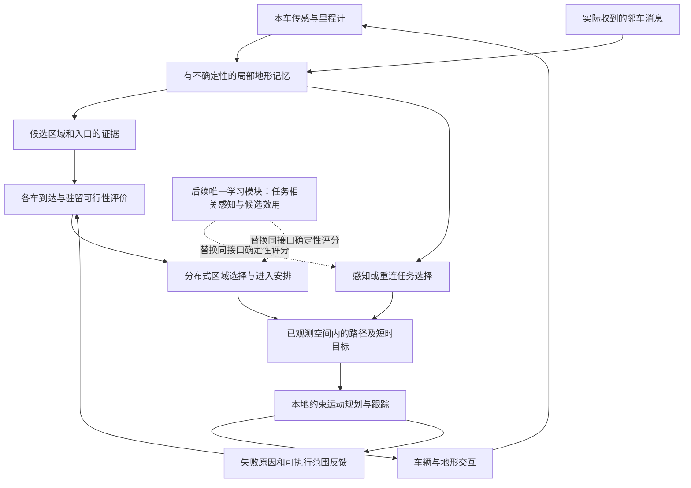

# 多月球车项目重设计：以联合终端可达性为核心

版本：research-design-v1，2026-09-19。状态：完整研究设计，尚未实现、未启动训练。依据：[27篇文献综述与路线审查](../references/terminal_feasibility_review_2026-09-19.md)。可执行验证顺序：[实验协议](../experiments/terminal_feasibility_research_protocol.md)。

## 1. 项目目标与边界

研究目标改为：**在未知地形和受限信息交换下，识别全队可达的终端区域，并完成安全进入和持续停留；解释信息结构、终端规划和奖励设计分别怎样影响可学习性。** MAPPO是候选基线，不再作为项目定义。

首次设计暂沿用“团队需要一块共同场地区域”的任务语义。实际作业用途尚待明确，当前0.75米、0.18米和0.25不能宣称来自月面作业规范。若实际目标只是安全停车，应单独建立停驻任务，不把更宽松的新任务与旧结果直接比较。

方法主案采用严格去中心化执行下的规划与学习分层。若研究约束要求核心决策从零纯RL，则采用第10节的学习对照路线；共同任务、信息预算和评估集保持一致。没有默认授权新的长训预算，也不恢复已暂停的Active-DSTC。

最终部署每辆车只使用自身传感、内部记忆和实际收到的消息；不使用运行时全局地图、全队真值或集中动作覆盖。离线全图规划和理想信息只服务于诊断。训练期Critic可用集中状态，但必须明确标为CTDE。

## 2. 任务定义：先确定要完成什么

### 2.1 两个独立的任务版本

**V0：历史任务冻结。** 保留原平坦度圆盘、几何、速度、保持、碰撞和96秒截止判据，供历史对照。新增诊断不能改变终止条件。

**V1：物理语义明确的终端任务。** 给定地图 $M$、车体足迹 $B_i$、作业区域 $W(c)$、定位/跟踪误差集合 $E_i$，定义联合终端集：

$$
\mathcal G(M)=\left\{x:\begin{array}{l}
\operatorname{WorksiteOK}(W(c),M),\\
\operatorname{SupportOK}(B_i(p_i,\theta_i)\oplus E_i,M)\quad\forall i,\\
\operatorname{Separate}(B_i\oplus E_i,B_j\oplus E_j)\quad\forall i\ne j,\\
d_{\max}\le d_g,\quad D\le D_g,\quad |v_i|\le v_g
\end{array}\right\}.
$$

工作区平整、车体支撑与通行安全分别检查。安全停驻版本可以没有 $W(c)$，但仍需要所有车体足迹和稳定性；是否要求朝向、通信连通和作业间距由任务决定。几何冗余条件保留用于解释，不能让多个相近指标悄悄重复奖励同一种收缩行为。

平坦度分成平均倾斜、去趋势高度残差、局部台阶/尖峰、估计不确定性。若仍保留原高度差，必须解释它对整体倾斜的限制。连续区域检验采用有分辨率和误差界的估计；有限点检查只报告离散验证。

### 2.2 到达与可保持是两个事件

历史连续8个底层步约为1.6秒，这是验收停留窗口，不等于控制不变性。V1要求提供可持续停留的后备控制策略，并对扰动后的恢复进行测试。

目标是构造或近似验证一个集合 $\mathcal K\subseteq\mathcal G$，使在声明的模型、误差和通信条件下，存在可实施的局部后备控制使状态继续留在 $\mathcal K$。若只能通过数值扰动测试，则称为“经验验证的驻留域”，不能称为已证明的鲁棒控制不变集。

### 2.3 可达性采用三值输出

候选区域必须带以下独立字段：

| 字段 | 含义 |
| --- | --- |
| `terrain_status` | 已验证满足、已验证不满足、未知 |
| `capacity_status` | 是否容纳全部车体和作业要求 |
| `reachability[i]` | 第i辆车已知可达、已知不可达、证据不足 |
| `entry_compatibility` | 到达路径/入口使用是否相容 |
| `hold_status` | 驻留策略及其适用假设 |

规划超时、局部优化失败和搜索预算耗尽均为“证据不足”，不得直接写成数学不可达。优先保留成功轨迹作为见证。

## 3. 场景生成：让困难可测量

保留Open/Mixed/Bottleneck作为展示标签，但增加控制实验变量：可行区域面积占比、区域数量、地形相关长度、路径绕行比、最窄通道宽度、入口数量、最迟车辆路程、信息初始可见性、通信时序连通性、终端容错余量。

建立两个分开的场景库：

- **可达见证库**：通过离线规划与闭环回放得到满足同一动力学和任务条件的联合轨迹，再隐藏地图供在线方法使用。见证证明“有解”，不是最优解。
- **自然采样库**：保留随机地形的真实分布，包括未知可行性和疑似无解实例；报告全体完成率及见证覆盖，不能只选择有利场景。

不要根据所提出方法能否解出场景来筛选基准。离线见证器也应至少使用两种初始化/路径策略，防止过度偏向某一种控制器。失败实例保留，而不是继续减少陨石坑直到本方法通过。

地图基础几何种子、地形扰动种子、初始队形和训练随机种子分别记录。训练/验证/测试必须按基础地形族划分；同一地图平移旋转不能充当真正的新地图泛化。

## 4. 系统架构与模块合同



这是拟设计的数据流，不代表每个模块已存在。传感、区域评价、选择、路径、运动、评分之间必须有可替换接口，使失败能被隔离。

| 模块 | 输入 | 输出与责任 | 不允许隐含承担 |
| --- | --- | --- | --- |
| 地形与定位belief | 传感、配准、时间戳 | 已测量/未知、误差与相关性 | 把插值圆盘称为全部实测 |
| 终端区域评价 | belief、车体与任务要求 | 区域几何、容量和缺失证据 | 仅质心平坦就声称全队可达 |
| 到达评价 | 本车状态、拓扑与邻车计划 | 到达代价范围、路径见证或未知 | 把欧氏距离当通行时间 |
| 团队选择 | 同版本候选和逐车报价 | 一致目标与可撤销的进入安排 | 用全队真值决定部署动作 |
| 局部路径 | 已观测自由空间、任务目标 | 可执行局部走廊/路标 | 要求NMPC自动处理所有拓扑绕障 |
| 运动控制 | 路标、局部地形、有效邻车计划 | 轨迹、停车尾段与失败说明 | 用停车掩盖长期无进展 |
| 学习评分 | 与确定性方法相同的信息 | 候选/感知任务的效用 | 改碰撞门槛或执行器来获得优势 |

## 5. 信息与通信设计

### 5.1 有限belief优先于更大编码器

地形缓存记录相对高度、倾斜、粗糙度、观测支持、不确定性、最近观测时间和来源。由稀疏观测外推的区域明确标为推断；只有给出空间正则性和误差界才可转化为保守验证。

首轮仍采用有限二维/2.5D记忆，不构建完整三维神经地图。CNN可编码地形，集合编码器处理邻居，GRU处理时序残差。已有结构先冻结，避免同时研究任务表示和架构容量。

### 5.2 坐标关联必须有来源

第一层实验允许理想相对定位，并明确标为理想信息。下一层注入里程计漂移、相对位姿误差和时钟偏差。消息携带局部坐标系标识、变换依据及误差，候选物理关联使用几何与来源，不单靠整数槽位ID。

不知道跨车坐标变换时，不得由仿真直接完成无误差配准却称作真实部署能力。允许先解决理想定位下的研究问题，但论文必须说明这一边界。

### 5.3 三类消息分开计费

1. 区域证据：区域边界、未验证部分、地形裕量、坐标误差、版本和来源。
2. 到达与选择：逐车代价、可达状态、入口冲突、选择版本和有效期。
3. 执行意图：已承诺轨迹、实际生效时刻、占据误差范围、停车尾段与过期行为。

先测试固定物理消息，再研究学习压缩；字节数包含头部、转发和重传，不以17维向量等价于完整协议开销。通信半径、频率、字节/秒、延迟、丢包分别控制。保持原12米作为一组基准，不把改变半径当成同信息条件的改进。

首个原型每车最多保留4个候选区域，定长边界摘要和有界转发；容量是工程起点，应测量截断导致的失败，不能据此宣称任务充分统计量只有4个候选。所需共享内容由信息对照实验决定。

## 6. 分布式选择：从平地分数改为全队完成代价

### 6.1 确定性完整任务基线

每车在同一候选版本下计算本地可实现的到达代价。已知图路径使用规划代价；未观测连接给出未知或校准的预测区间，不伪装成精确路径长度。首个可比较评分可写为：

$$
J(c,\sigma)=\max_i\widehat T_i(c,\sigma)
+\lambda_E\sum_i\widehat E_i
+\lambda_U U(c,\sigma)
+\lambda_M\operatorname{Bytes}(c,\sigma).
$$

$\sigma$包含必要的进入顺序与候选终端构型。地形、碰撞和容量作为可行条件；时间、能耗、通信和不确定性作为明确报告的选择偏好。没有校准依据的 $\widehat T$ 只称估计，不称上界。

这比“挑最近/最平的点”更接近任务，但分布式有限候选搜索依然不是全局最优。首轮不学习权重，先用预注册的量纲归一化和小范围敏感性分析验证机制。

### 6.2 不让先到车堵住入口

若候选只有一个入口，将其视为有限时空资源。车辆先抵达等待区，再按已协商的次序进入；最终占据位置必须保留后续车辆通路。终端位置从区域和车体几何得到，不使用全图Oracle提前给出的专属槽位。

分布式终端位置分配本身仍是显式协调机制，应作为一项独立消融，不能以换个名称隐藏过去对“槽位”的限制。若必须禁止显式位置分配，则保留连续目标学习分支，并单独测试它能否形成等价的无堵塞安排。

### 6.3 目标变更与协议完成性

候选发现、初步偏好和运动承诺分开。新证据可以更改初步偏好，但不能让执行中的车辆瞬间丢失共同目标。目标变更需要版本、失效原因、有效期与旧轨迹安全退出条件；设置迟滞避免微小评分变化造成来回切换。

在固定团队、已知时延上界、有限时间连通和无故障假设下，可设计确定性候选排序及确认流程；必须证明或测试最终一致与进展。任意永久断联时不能同时承诺完整任务完成和无冲突共同变更。超时应返回“信息不足/未完成”及可验证后备动作，不把缺消息当同意，也不无限制等待全签。

此处是新的待验证协议要求，不直接复用或重新启用Active-DSTC的状态机与奖励。

## 7. 动作与执行：给高层一个真实有用的控制接口

### 7.1 两个时间尺度

任务决策选择“验证某区域、获取某入口信息、重连交换、前往已选区域、等待/让行”等持续任务。各任务具有启动条件、停止条件和最大时长。最大时长和刷新频率通过实测控制有效性确定，不能仅因为旧版每秒决策而固定。

低层每0.2秒更新运动。保留当前差速模型作为机制研究起点；精度验证再增加延迟、滑移、接触与跟踪误差。低层必须提供原始请求、实际执行、介入原因和位移。

### 7.2 路径拓扑与NMPC分开

已观测地图上增加轻量局部图搜索或采样路径作为拓扑基线，NMPC负责沿可行走廊推进与动态邻车约束。未知区域只允许经过验证的探索前缀。该设计明确改变了exp167不做独立路径搜索的首轮边界，是待实施的新设计选择。

对NMPC保留输出控制重算轨迹、同一模型复核和停车尾段。后续先检验：改变目标是否导致方向正确的运动、如何绕过局部极小值、预测误差是否受控、低速和停车是否递归可行。未证明时只报告经验效果。

### 7.3 安全与进展分别管理

短时轨迹避碰借鉴MADER/RMADER的消息语义，但要单独满足其时延及承诺假设。完全丢包时退回声明的本地感知/停车模型，不能沿用RMADER的有界延迟安全证明。

检测持续无进展、反复动作切换和等待依赖环。解决方法优先是变更入口顺序、退到已验证等待区或更换区域；不得直接放宽安全距离。优先级或令牌可能导致饥饿、环路或失联阻塞，必须有有界租期、稳定tie-break和公平性测试。局部避碰控制本身不承诺全局无死锁。

## 8. 奖励与学习问题重新定义

### 8.1 首先冻结评价目标

主目标是截止时间内完成整个终端任务的概率；安全失败、超时、能耗和通信开销分别报告。若要标量训练目标，明确它代表怎样的偏好，不能认为任意加权和必然等价于“成功优先”。

最干净的机制对照采用固定有限时域、成功指示目标，时间作为状态输入。附加成本作为约束或独立次级目标；设置训练权重时应展示成功与成本的取舍。碰撞可以终止回合，但提前碰撞减少后续时间惩罚的效应必须计入回报审计。

### 8.2 时间折扣按秒定义

若需要时间偏好，令 $\gamma(\Delta t)=\exp(-\Delta t/\tau)$，并报告 $\tau$ 或半衰期。高层持续 $k$ 个底层步时：

$$
R_t=\sum_{j=0}^{k-1}\gamma^j r_{t+j},\qquad
\Gamma_t=\gamma^k.
$$

比较无折扣有限时域目标与有时间偏好目标时，说明二者优化问题不同。当前exp167已有持续时间折扣，不应以新增同一公式冒充改进；需要审查的是其13.79秒半衰期是否符合96秒任务的偏好。

真正任务截止是有限时域终端；采样缓冲截断是训练截断。两者bootstrap与势函数尾项要分别处理。高层任务结束不是整个回合终止。

### 8.3 塑形只辅助，不悄悄重写任务

优先用有界势函数：

$$
F_t=\Gamma_t\Phi(z_{t+k})-\Phi(z_t).
$$

$z$包含需要的历史、剩余时间和目标版本；真正回合终止时统一定义终端势值为0。选址变更不能重新初始化势值获得额外奖励。候选为空、belief更新、消息过期和无解状态都必须有有限定义。

候选势函数可近似剩余任务代价或联合终端距离，不再将“越靠拢越开启惩罚”作为默认结构。未知时不强迫队形立即收缩。地图信息增益如果作为额外任务奖励会改变目标；若用于塑形则必须经过上述尾项检查，不把重复扫描或重复commit变成稳定收益源。

折扣相消的代数性质在固定信息政策类下可逐路径核对，但不能直接推出非凸函数逼近与有限样本训练收敛。若训练奖励本身被Actor作为观测输入，必须检查是否额外泄漏信息。

### 8.4 先验证学习有没有必要

优先学习的唯一模块是任务相关感知/候选效用：在同样的候选、消息、控制器和预算下，学习决定哪项验证最有价值、何时结束探索并迁移。协议正确性、车体约束和低层可行性不靠该网络重新学习。

建议先用现有循环MAPPO作为基线，只改变任务决策接口；不同时加入新信用算法、学习通信和新编码器。训练期可利用真值评价终端结果与拟合Critic，但部署评分不得查询真值。纯RL主张应明确为“高层从零强化学习，低层模型控制”，不能称整个系统端到端纯RL。

如果确定性基线已经满足全部要求，学习的价值只能是显著改善信息/时间/能耗或分布外适应；没有增益就保留非学习解。新贡献可以是任务表征与因果证据，不必强行是新网络。

## 9. 何时可以声称安全、协调或可学习

| 主张 | 至少需要的条件与证据 |
| --- | --- |
| 区域满足任务 | 物理语义、采样分辨率、误差和完整车体覆盖 |
| 全队可达 | 同模型轨迹见证及闭环回放；在线估计另报告误判 |
| 去中心化执行 | 每个决策的输入来源、实际消息日志、真值访问隔离 |
| 一致共同选择 | 相同物理候选关联、协议假设、版本变化与断联测试 |
| 安全驻留 | 可实施后备策略、声明扰动集合和不变性论证或经验测试 |
| 无死锁 | 适用场景类的理论条件，或限定测试集上的失败率；不作泛化保证 |
| 可学习 | 固定政策类/信息/预算，多seed重复，成功曲线及样本效率；不是只看reward |
| 优于已有方法 | 同任务同信息同资源配对对照，置信区间和失败分解 |

信息充分、奖励正确与控制可行只是重要条件，不构成一般深度MARL的充分收敛定理。研究应给出局部命题、机制实验和统计结论，并承认不能证明的部分。

## 10. 三条路线的选择与停止规则

| 路线 | 研究作用 | 当前建议 |
| --- | --- | --- |
| 直接循环MAPPO输出连续局部目标 | 检验在原动作接口下信息与奖励是否足够 | 保留受控基线，暂不追加全任务长训 |
| 确定性局部belief＋共同区域/进入规划＋运动控制 | 建立完整任务能做成的参照，隔离可学习性 | 首先实现并验证，无需训练 |
| 同接口的学习感知/区域效用＋固定执行器 | 研究任务相关信息价值与学习增益 | 仅在上一条完整闭环可靠后进入 |

若用户要求从零纯RL控制，则另外设置已知目标、单车、双车到四车、理想信息到受限信息的学习序列，保留明确的非学习诊断上界。不能把“必须纯RL”作为删除执行能力验证的理由。

如果理想信息的控制基线仍无法稳定集合，先修控制与任务几何；如果理想信息成功而局部信息失败，才研究主动信息；如果确定性局部信息成功而学习失败，才聚焦目标、探索、表示和优化；如果学习只降低碰撞却全部超时，不称为进步。

## 11. 从当前仓库迁移

### 11.1 保留的资产

保留地形生成、差速代理、指标实现、冻结场景机制、运行manifest、exp167规划修正与诊断。N1/GRU作为参考编码器。历史失败checkpoint和旧配置用于复现，不进入新版继续训练。

### 11.2 新模块的建议布局

```text
tasks/multi_rover_gathering/
  terminal_task/       # V0/V1任务、足迹、终端及驻留验证
  local_belief/        # 本车传感、定位与地形不确定性
  regional_planning/  # 候选区域、入口、逐车到达评价
  coordination/       # 消息、版本、分配、进入时序
  execution/          # 路径、NMPC/替代控制与后备行为
  task_learning/      # 只替换高层评分的学习接口
  diagnostics/        # 真值见证、反事实与阶段失败标签
```

这是设计布局，文件夹尚未创建。先用适配层复用稳定部件，再逐步迁移；不进行一次性全仓重写。每个运行冻结 `task_version/information_version/controller_version/reward_version` 和实现hash。

### 11.3 四个实施包

| 顺序 | 交付物 | 验证与结束条件 |
| --- | --- | --- |
| P0 任务与因果审计 | V0影子判据、几何反例、地图见证标签、动作效果审计 | 明确原任务可行性与执行限制；不训练 |
| P1 完整任务控制参照 | 已知区域的多车到达/让行/驻留；再加入去中心化同信息版本 | 先在小见证库完成完整闭环；失败先定位机制 |
| P2 信息限制研究 | 成对不可区分地图、不同消息内容、主动验证与重连 | 给出信息条件改变完成率的因果证据 |
| P3 学习研究 | 同接口确定性/学习评分配对，多seed与分布外评估 | 学习必须证明额外效益，随后才做高保真迁移 |

在当前CPU吞吐下，旧NMPC pilot约14.58环境步/秒，1M同类交互约19.1小时、40M约31.8天，均为基于旧吞吐的粗估，不是新版性能承诺。不能直接沿用旧256并行GPU代理的训练预算。先测新控制器耗时，再冻结可承担预算。

## 12. 论文定位与可发表贡献的边界

建议题目方向：**有限信息下多机器人地形约束集合的联合可达性与学习条件**。

拟研究的贡献最多聚焦三项：给出信息受限的不可区分反例与可测条件；构建同时考虑区域容量、最迟到达和进入冲突的任务表示；通过受控实验解释信息、奖励与执行器分别造成的学习失败及修复收益。

“把GRU、NMPC、通信协议和MAPPO连接起来”本身不足以成为方法创新；候选区域、分层与安全过滤已有广泛研究。是否有新颖性，需要在具体算法确定后对更窄的问题进一步检索。即使最终非学习方法最好，也应如实报告；项目的科学价值不能依赖预先指定RL必须获胜。
