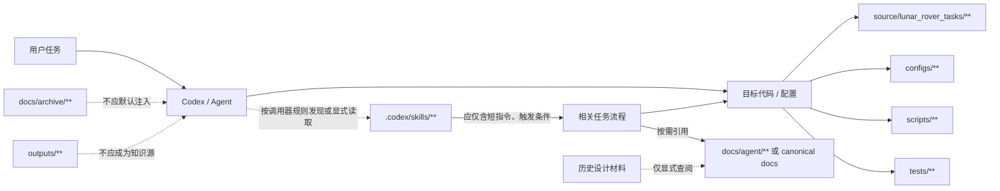
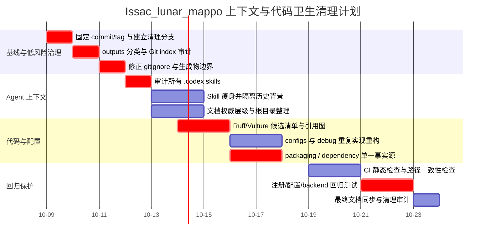
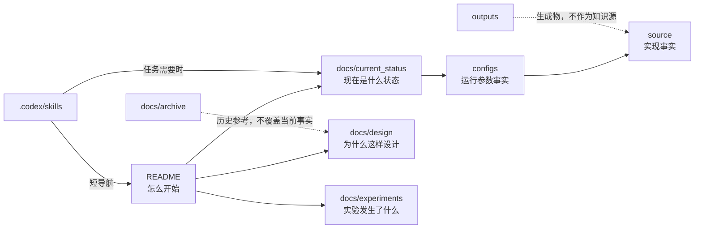

# Issac_lunar_mappo 仓库静态审计与 Codex 上下文卫生研究报告

> 历史外部审计材料，仅供追溯。文中基线提交、文件名和建议步骤并不全符合本地仓库；已实施治理以 [docs/current_status.md](../current_status.md)、[文档入口](../README.md)及实际 Git 状态为准。不要把下文时间表当作当前工作指令。

## 执行摘要

本报告以仓库默认分支 `main` 为审计对象，并将静态审计基线固定在本次读取到的提交 `b914f0b71d9dfd322aa14fa6a877f2a286777d6d`。仓库公开根目录可确认包含 `.codex/skills`、`.github/workflows`、`configs`、`docs`、`outputs/isaac_scenes`、`scripts`、`source/lunar_rover_tasks`、`tests`、`tools`，以及 `.gitignore`、`README.md`、两个根目录设计文档、`pyproject.toml` 和 `setup.py`。README 将项目定位为 Isaac 多车月面任务第一阶段脚手架，当前使用 proxy rover 和 Torch 向量化动力学，在真实 rover articulation 可用之前验证 observation/action/reward/termination/training 闭环。citeturn2view0

**总体结论：项目目前最值得优先处理的并不是核心 MAPPO/环境代码，而是“仓库边界与信息层级不够清晰”造成的上下文卫生问题。** 最明显的四个风险点是：

1. **`outputs/` 的语义与实际 Git 状态存在明显张力。** README 明确声称训练生成物位于 `outputs/` 且“由 git 忽略”，但 GitHub 根目录同时公开显示已跟踪的 `outputs/isaac_scenes`。这不一定是 bug——可能是历史文件已经被 Git 跟踪、存在 `.gitignore` 例外、或者 `isaac_scenes` 被有意作为固定 fixture 保存——但从静态仓库卫生角度，这是目前最应首先厘清的对象。若里面确为生成物，会同时增加 clone 体积、代码检索噪声以及 AI 代理阅读无关文件的机会。citeturn2view0
2. **仓库确实存在自定义 `.codex/skills`。** 这意味着“技能文件污染上下文”不是假设问题，而应作为独立治理对象；但在本次可复核材料中，尚不能证明每个 skill 的具体文件名、自动加载机制和调用者，因此不能把“目录存在”进一步夸大为“所有技能都会自动注入 Codex 上下文”。正确策略是先把 skill 做成小入口、按需引用大文档，而不是直接删除整个 `.codex`。citeturn2view0
3. **存在至少三套可能重复表达项目规范的信息入口：** 根 `README.md`、`docs/**`、两个根目录长篇设计 Markdown；此外 `.codex/skills/**` 很可能还会再表达一部分操作规范。README 已经把 `docs/README.md`、`docs/current_status.md` 和 `docs/experiments/README.md` 定义为主要文档入口，并把历史日志放到 `docs/archive/`，因此继续把长篇设计文档留在仓库根目录会削弱“单一信息入口”的清晰度。citeturn2view0
4. **Python 打包存在潜在的双源问题。** 根目录同时存在 `pyproject.toml` 与 `setup.py`，而 README 给出的实际安装命令却是 `pip install -e source/lunar_rover_tasks`。仅凭文件名不能断言 `setup.py` 已冗余，但必须比较三者的 metadata、dependencies、entry points 和 package discovery；在确认之前，不建议删除任何一个。citeturn2view0

从清理优先级看，建议顺序为：

**P0：固定基线 → 审计 `outputs/` → 审计 `.codex/skills` → 消除文档/配置单一事实源冲突**\
**P1：统一 packaging 与依赖声明 → 合并重复脚本/配置 → 加强 CI 静态检查**\
**P2：清理历史文档、命名与小型代码卫生问题。**

核心原则是：**不要把“静态未发现引用”直接等价成“可删除”。** Isaac Lab/Gymnasium 注册、配置字符串、插件式 discovery、CLI 动态导入和训练框架注册都可能制造静态引用分析的假阳性。因此，对核心 `source/`、配置、注册代码以及训练入口应采用“先建立引用图，再删除”的高风险策略；对生成物、过时文档和重复代理说明则可以更积极地清理。

> **审计证据边界：** 本次确认了仓库递归树、默认分支及根目录结构，并读取到了公开 README；但当前可复核会话材料没有完整保留每一个 Python blob 的逐行内容。因此，下文不会伪造具体的“未使用函数 X/Y/Z”。符号级删除结论只有在能够逐行确认定义、导入、动态注册和调用点时才应成立。也就是说，下面对文件/模块层面的结论可以直接用于治理，而“函数/类级 dead-code 表”明确区分为“已确认”与“待本地静态工具验证”。

## 审计基线、架构边界与判定方法

仓库根目录当前呈现出较合理的工程分层：运行代码位于 `source/lunar_rover_tasks`，执行入口位于 `scripts`，实验配置在 `configs`，测试在 `tests`，辅助工具在 `tools`，工作流在 `.github/workflows`，文档在 `docs`；README 给出的主要训练命令是 `scripts/train.py --config configs/experiment/exp_001_minimal.yaml ...`，同时提供 `debug_env.py`、`debug_observation.py`、`debug_reward.py` 等调试入口。README 还声明默认训练 backend 是真实 SKRL MAPPO，而 `--backend smoke` 是本地快速调试路径。citeturn2view0

README 指定的目标环境为 Python 3.12、Isaac Sim 6.0.0、Isaac Lab v3.0.0-beta、PyTorch 2.10.0+cu128，以及通过 Isaac Lab `rl[skrl]` 安装的 SKRL；注册任务 ID 为 `Isaac-MultiRover-Gathering-Direct-v0`。这些值应被视为当前仓库文档中的**目标版本声明**，而不是本报告经过实际环境安装验证后的兼容性结论。citeturn2view0

### 判定标准

本报告使用四类处置：

| 判定 | 含义 |
|---|---|
| **可删除** | 文件是生成物、缓存、已经被更权威文件完全替代，且确认没有运行时消费者后应从 Git 删除 |
| **需合并/迁移** | 内容本身有价值，但位置、重复表达或维护方式会导致多个事实源 |
| **需隔离** | 对运行代码没有直接价值，但可能影响 AI/Agent 上下文；应改成按需加载 |
| **需保留** | 属于核心代码、测试、CI、canonical 配置或设计基线，删除收益小而风险大 |

风险评估中的“高”尤其适用于 `source/**`、Gym/Isaac 注册、训练配置和 packaging 文件，因为静态 grep 可能看不到字符串注册、entry point、配置加载等隐式依赖。

### 上下文污染与运行风险不是同一维度

需要特别区分：

**运行时冗余**意味着删除后程序行为不变；\
**Codex/Agent 上下文冗余**则意味着文件即使完全不影响 Python 运行，也可能在代码搜索、文档检索或代理阅读过程中提供相互矛盾、过时或重复的信息。

因此：

- 一个历史 Markdown 可能是**运行风险低、上下文污染高**；
- 一个看似没人直接 import 的环境注册模块可能是**上下文污染低、运行风险极高**；
- `.codex/skills` 则可能是**运行风险低、代理行为风险中高**。

这也是本报告不建议用一次简单的 `grep` 大规模删代码的原因。

## 文件与模块处置矩阵

下表覆盖本次能够从仓库树和 README 明确识别的顶层文件/模块，并把不能在当前证据下直接删除的对象明确标成“审计后处理”，以避免假阳性。

| 路径 / 模块 | 类型 | 判定 | 判定理由与影响范围 | 建议操作 | 优先级 | 风险 |
|---|---|---|---|---|---|---|
| `outputs/**` | 训练/运行产物 | **优先审计，原则上可删除出 Git** | README 称训练产物位于此处并由 Git 忽略，但 GitHub 当前仍显示跟踪的 `outputs/isaac_scenes`，说明“生成物边界”至少不够明确。会增加检索与上下文噪声。citeturn2view0 | 先 `git ls-files outputs`；生成物执行 `git rm --cached`，真正 fixture 移至明确的 `tests/fixtures` 或 `assets` | **高** | 中 |
| `outputs/isaac_scenes/**` | 场景输出/资产候选 | **需分类** | 目录被 Git 跟踪，但名称又位于 output namespace。它可能是可复现生成物，也可能是不可替代场景资产，不能仅按目录名删除。citeturn2view0 | 对每项标记 `generated / fixture / source asset`；仅 generated 移出 Git | **高** | **高** |
| `.codex/skills/**` | 自定义 Agent skill | **需隔离/瘦身** | 仓库明确存在 Codex skills；这些内容若重复 README、命令、架构规范，会产生代理信息竞争。citeturn2view0 | Skill 仅保存触发条件、任务流程与必要约束；长篇知识迁往 `docs/agent/` 并按需链接 | **高** | 中 |
| `.github/workflows/**` | CI/CD | **保留并加强** | 仓库已经存在 workflow 目录；它是防止清理回归的最佳自动检查位置。citeturn2view0 | 不删除；加入 lint、dead-import、测试、docs/path 校验 | 中 | **高** |
| `source/lunar_rover_tasks/**` | 核心 Python package | **保留** | README 的可编辑安装直接指向该 package，显然属于实际运行核心。citeturn2view0 | 只做符号级重构；任何删除前检查注册/配置/CLI 间接引用 | **高** | **高** |
| `scripts/train.py` | canonical 训练入口 | **保留** | README 明确把它作为第一阶段 MAPPO 训练命令，并声明有 `MAPPO` 与 `smoke` 两个 backend。citeturn2view0 | 将其确立为唯一 canonical train CLI；其他训练脚本应调用共享模块而非复制实现 | **高** | **高** |
| `scripts/debug_env.py` | 调试入口 | **保留或合并 CLI** | README 明确引用；并非静态“未使用脚本”。citeturn2view0 | 保留；若三个 debug 脚本共享大量初始化逻辑，抽出 `tools/debug_common.py` | 中 | 中 |
| `scripts/debug_observation.py` | 调试入口 | **保留或合并 CLI** | README 明确引用。citeturn2view0 | 同上，可逐步统一成 `scripts/debug.py observation` | 中 | 中 |
| `scripts/debug_reward.py` | 调试入口 | **保留或合并 CLI** | README 明确引用。citeturn2view0 | 同上，可逐步统一成 `scripts/debug.py reward` | 中 | 中 |
| `configs/**` | 实验/环境配置 | **保留并去重** | `scripts/train.py` 的公开示例直接引用 `configs/experiment/exp_001_minimal.yaml`，属于运行路径的一部分。citeturn2view0 | 建立 base config + experiment delta；禁止复制整份配置只改少量参数 | **高** | **高** |
| `configs/experiment/exp_001_minimal.yaml` | 示例/canonical experiment | **保留** | README 将其作为最小训练示例。citeturn2view0 | 指定为 smoke/canonical 最小配置，并由 CI 校验路径存在 | 高 | 中 |
| `tests/**` | 测试 | **保留并扩充** | 根目录明确有测试，README 也要求直接运行 `pytest`。citeturn2view0 | 加回归测试覆盖 config 加载、注册、reward/observation shape、backend 选择 | **高** | **高** |
| `tools/**` | 工程辅助工具 | **逐文件审计** | 根目录存在，但 README 没有把它列为用户主入口，因此尤其容易积累一次性脚本。citeturn2view0 | 每个工具标记 owner/用途；一次性迁移脚本移动至 `tools/archive` 或删除 | 中 | 中 |
| `docs/README.md` | 文档入口 | **保留** | 根 README 明确要求优先阅读。citeturn2view0 | 作为 docs 索引，只做导航，不复制完整安装/训练说明 | 高 | 低 |
| `docs/current_status.md` | 当前状态 | **保留** | README 明确把它作为当前文档入口。citeturn2view0 | 只保留“当前成立”的事实，历史状态迁入 archive | 高 | 低 |
| `docs/experiments/README.md` | 实验索引 | **保留** | README 将其列为主要入口。citeturn2view0 | 每个实验关联 config、commit、seed、结果 JSON，而不是重复项目架构说明 | 中 | 低 |
| `docs/archive/**` | 历史文档 | **保留但从默认 Agent 知识路径隔离** | README 已明确把长篇历史日志放入 archive；这本身是正确方向。citeturn2view0 | 索引中标记 Historical / Non-authoritative；skill 不应默认引用 archive | 中 | 低 |
| `isaac_sim_skrl_mappo_multi_rover_tech_doc_v2_0.md` | 根目录长篇技术设计文档 | **迁移，不建议直接删** | 根目录已经另有 docs 主入口；长技术文档放根目录扩大“哪个文档权威”的歧义。citeturn2view0 | 迁至 `docs/design/`；顶部增加状态 `design baseline / historical / current` | 中 | 低 |
| `multi_rover_isaac_project_scaffold_v1_0.md` | 根目录项目脚手架设计 | **迁移/归档** | 项目 README 明确说当前实现是两个设计文档的第一阶段脚手架，故文档有 provenance 价值，不应无证据删除。citeturn2view0 | 迁至 `docs/design/` 或 `docs/archive/design/`；记录“implemented through commit …” | 中 | 低 |
| `README.md` | 项目入口 | **保留并精简为唯一 quick-start** | 已经承担环境、命令、task ID 和文档导航。citeturn2view0 | 只保留当前可执行路径；历史解释、算法细节链接到 docs | **高** | 低 |
| `pyproject.toml` | Python build/config | **优先作为候选单一事实源** | 根目录同时存在 `setup.py`；存在 metadata/dependency 双写风险。citeturn2view0 | 比对后将 build metadata 集中到 `pyproject.toml`；前提是 Isaac/现有工具链允许 | **高** | **高** |
| `setup.py` | legacy/兼容 packaging | **待比较后保留或删除** | 与 `pyproject.toml` 共存本身不是错误，但若内容重复就会形成第二事实源。citeturn2view0 | `diff` dependencies/package discovery/entry points；确认无消费者后再移除 | 高 | **高** |
| `.gitignore` | VCS 配置 | **保留并修正** | README 对 `outputs/` 的描述必须由 `.gitignore` 与 Git index 实际状态共同实现。citeturn2view0 | 明确 outputs、cache、checkpoint、日志规则，并清理已跟踪生成物 | **高** | 低 |
| 仓库名 `Issac_lunar_mappo` | 命名/URL | **暂时保留** | 仓库名使用 `Issac`，README 内容使用标准拼写 `Isaac`。citeturn2view0 | 文档中统一产品/技术名称为 `Isaac`；不要仅为拼写问题立即 rename repo，避免链接断裂 | 低 | 中 |

### 最明确的“可删除”候选

目前从公开静态证据出发，唯一应当**积极推进删除出 Git**的类别是：

```text
outputs/** 中能够重新生成、且没有测试或运行时读取者的产物
```

而不是 `source/**` 中某个看起来没人 import 的函数。

尤其应先执行：

```bash
git ls-files outputs
git check-ignore -v outputs/* 2>/dev/null || true
git status --ignored
```

若确认其中项目确实属于生成物：

```bash
printf '\n# Generated training/runtime artifacts\noutputs/\n' >> .gitignore

# 只从 Git 索引移除，不先删除工作区文件
git rm -r --cached outputs/

git add .gitignore
git commit -m "chore: stop tracking generated outputs"
```

若 `outputs/isaac_scenes` 中存在真正需要版本控制的固定场景，应先把它搬至语义正确的位置，例如：

```text
assets/isaac_scenes/
tests/fixtures/isaac_scenes/
```

然后再 ignore `outputs/`。这样比设置复杂的 `!outputs/isaac_scenes/**` 例外更容易让人类和 Codex 理解。

## 代码、配置、依赖与 CI 静态分析

### 未引用函数、类和变量

**本次能够达到“可删除”证据阈值的具体 Python 函数/类/变量：0 项。**

这里的“0”**不等于仓库不存在 dead code**，而是当前获得的可复核资料不足以诚实地对具体 symbol 下删除结论。仅凭根目录和递归 tree 无法区分：

```python
class SomeConfig:
    ...
```

究竟是真的无人使用，还是被类似下面的机制间接加载：

```python
gym.register(
    id="Isaac-MultiRover-Gathering-Direct-v0",
    entry_point="lunar_rover_tasks....",
)
```

README 已明确表明仓库存在 Gymnasium task 注册 ID，因此对环境类、config class、registration module 使用普通“查不到直接函数调用 = dead”规则尤其危险。citeturn2view0

建议在本地基线 commit 上生成真正可以审阅的 symbol 清单，而不是直接自动删除：

```bash
# 未使用 import、局部变量、未定义名字
ruff check . --select F401,F841,F821

# 更激进的静态 dead-code 候选，只生成候选，不自动删
vulture source scripts tools tests --min-confidence 90
```

随后对每一个候选执行三层搜索：

```bash
# 精确标识符引用
git grep -n '\bCandidateSymbol\b'

# 字符串/配置引用
git grep -n 'CandidateSymbol'

# 模块/路径引用
git grep -n 'module_name'
```

建议使用如下删除门槛：

| 候选类型 | 自动删除？ | 原因 |
|---|---:|---|
| 未使用局部变量 | 可以，在测试通过后 | 动态注册风险低 |
| 未使用 import | 通常可以，但需看 side effect | Isaac/Gym 注册模块可能通过 import side effect 工作 |
| 私有 helper，无调用点 | 可考虑 | 仍需查 tests/config |
| public function/class | 否 | 可能供 scripts、配置或插件调用 |
| env/config/registration class | **禁止仅凭 vulture 删除** | 动态加载/字符串注册风险高 |
| reward/observation callback | **禁止仅凭 vulture 删除** | 很可能通过配置或函数表间接引用 |

### 重复实现的重点搜查区域

虽然当前证据不足以逐行给出“第 X 行与第 Y 行相同”的伪精确结论，但从已确认的入口结构看，以下重复源值得优先检查。

#### 三个 debug 脚本

README 同时暴露：

```text
scripts/debug_env.py
scripts/debug_observation.py
scripts/debug_reward.py
```

citeturn2view0

如果三者各自重复执行设备解析、环境创建、seed、task registration、config loading 等初始化代码，建议把公共部分提取成：

```python
# tools/debug_common.py
def create_debug_env(...):
    ...

def load_debug_config(...):
    ...
```

再逐步把 CLI 收口成：

```bash
python scripts/debug.py env --steps 200
python scripts/debug.py observation
python scripts/debug.py reward
```

但只在确认现有脚本确有 substantial duplication 时执行；仅仅存在三个脚本不是冗余证据。

#### MAPPO 与 smoke backend

README 明确说明 `scripts/train.py` 默认走真实 SKRL MAPPO backend，而 `--backend smoke` 使用紧凑的本地 trainer。citeturn2view0

这是最容易长期产生两套训练逻辑的地方。理想结构不是：

```python
if backend == "skrl":
    # 一整套 rollout / observation / logging...
else:
    # 再复制一整套 rollout / observation / logging...
```

而应该是：

```python
env = build_env(cfg)
spec = build_training_spec(cfg)

trainer = build_trainer(
    backend=args.backend,
    env=env,
    spec=spec,
)

trainer.run()
```

即 smoke backend 可以不同，但 **environment construction、observation/action contract、seed、config parsing、logging schema 必须共享**。否则 smoke 测试通过不代表生产 MAPPO 路径有效。

### 配置冲突清单

| 项目 | 当前观察 | 风险 | 建议 |
|---|---|---:|---|
| `configs/**` vs Python config class | README 已确认 YAML experiment config 是真实入口。citeturn2view0 | 高 | 不要同时在 YAML 和 Python 写同一默认值；确定 ownership |
| experiment 配置复制 | 有 `configs/experiment/exp_001_minimal.yaml`，其他实验数量本次未逐行确认 | 中 | 后续实验只存 delta，避免 copy-paste 整份 YAML |
| README 默认值 vs config 默认值 | README 写死版本、backend、config path | 中 | CI 检查 README 示例路径真实存在 |
| `MAPPO` vs `smoke` backend | 两条执行路径 | 高 | 共享 env/config/schema，仅 trainer adapter 不同 |
| `.gitignore` vs `outputs/` | README 声称 outputs ignored，但仓库仍跟踪其中目录。citeturn2view0 | **高** | 立即分类现有 tracked outputs |
| 根 `pyproject.toml` vs `setup.py` | 两套 packaging 文件同时存在。citeturn2view0 | 高 | 比较 metadata 后建立单一 source of truth |
| 根 package metadata vs `source/lunar_rover_tasks` 安装入口 | README 实际安装子目录 package。citeturn2view0 | 高 | 明确根 packaging 文件究竟服务 repo 工具还是 package |

### `pyproject.toml` 与 `setup.py` 的修复方式

不要直接删除 `setup.py`。先比较：

```bash
sed -n '1,240p' pyproject.toml
sed -n '1,240p' setup.py

find source/lunar_rover_tasks -maxdepth 2 \
  \( -name 'pyproject.toml' -o -name 'setup.py' -o -name 'setup.cfg' \) \
  -print
```

重点比较：

```text
name
version
python_requires / requires-python
install_requires / dependencies
extras
package discovery
entry_points / project.scripts
Isaac Lab extension metadata
```

若根 `setup.py` 只是现代 metadata 的重复层，可以逐步收口到 `pyproject.toml`；若它被 Isaac Lab extension discovery 或现有安装方式依赖，则应保留薄 wrapper。

**不要同时手工维护两份 dependency 数组。**

例如理想目标之一是：

```toml
[project]
name = "..."
requires-python = ">=3.12"
dependencies = [
    # 只放该包真正直接依赖的库
]
```

而 `setup.py` 若必须存在，只读取相同 metadata，而不再复制一份版本号和依赖表。

### 依赖验证

README 给出的环境版本组合比较具体，因此应锁定“声明”和“实际安装解”之间的关系，而不能只写文档。citeturn2view0

静态清理完成后，建议在**隔离环境**运行：

```bash
python -m pip check
python -m pip list

# 查看 package 声明是否真的可解析；不把结果提交为运行产物
python -m pip install --dry-run -e source/lunar_rover_tasks
```

如果最终使用 lock 文件，应区分：

```text
pyproject.toml       # 人工维护：直接依赖与允许范围
requirements.lock   # 机器生成：完整解析结果
```

而不是同时维护：

```text
requirements.txt
environment.yml
setup.py
pyproject.toml
README dependency list
```

五份相互独立的版本真相。

### CI 与测试治理

仓库已经存在 `.github/workflows`、`tests`，而 README 将 `pytest` 列为第一阶段标准命令。citeturn2view0 因此删除/重构应利用现有 CI，而不是另建一套清理脚本体系。

建议 CI 至少形成四道门：

```yaml
# 示意结构，不是对现有 workflow 的逐行替换
- name: Lint
  run: ruff check .

- name: Tests
  run: python -m pytest -q

- name: Reject tracked generated artifacts
  run: |
    if git ls-files outputs | grep -q .; then
      echo "generated outputs are tracked"
      exit 1
    fi

- name: Check documented paths
  run: |
    test -f scripts/train.py
    test -f configs/experiment/exp_001_minimal.yaml
    test -f docs/current_status.md
```

如果 `outputs/` 确实需要保存少量 fixture，第三项应改成 allowlist，而不是整个目录禁止。

这里还存在一个有价值的测试原则：**`smoke` backend 不能成为另一套“比较容易通过”的 contract。** observation shape、action shape、termination semantics、reward components、seed/config loading 应由同一测试同时约束 MAPPO 路径和 smoke 路径。

## 文档、示例与自定义 Skill 治理

### 文档的主要问题不是“太多”，而是权威层级

README 已经设计了一个不错的文档入口：

```text
docs/README.md
docs/current_status.md
docs/experiments/README.md
```

并说明长期历史日志应放到 `docs/archive/`。citeturn2view0

因此建议正式建立如下信息架构：

```text
README.md
│
├── docs/README.md                 # 文档总索引
│
├── docs/current_status.md         # 当前唯一状态真相
│
├── docs/design/
│   ├── isaac_sim_skrl_mappo_multi_rover_tech_doc_v2_0.md
│   └── multi_rover_isaac_project_scaffold_v1_0.md
│
├── docs/experiments/
│   ├── README.md
│   └── ...
│
└── docs/archive/
    └── ...
```

根目录两个长设计文档不建议直接删除，因为 README 明确说明“当前实现使用两个设计文档中的第一阶段脚手架”，这说明它们具有需求 provenance 价值。正确操作是**迁移、标记状态、减少默认可见性**。citeturn2view0

每篇设计文档顶部建议增加：

```markdown
> Status: Design baseline / Historical reference
> Current implementation status: see ../current_status.md
> Canonical commands: see ../../README.md
> Do not copy version numbers or run commands from this document.
```

这样可显著降低 Codex 从旧设计文档复制过期命令的概率。

### README 同步化步骤

README 当前已经包含非常具体的环境和 CLI，包括本地虚拟环境名 `.venv_isaaclab`、Python 3.12、三个 debug script 和训练命令。citeturn2view0 这种 README 可操作性很好，但写得越具体，越容易产生漂移。

推荐同步步骤：

**README 只负责四件事：**

```text
项目是什么
当前支持什么
最短安装/测试/训练路径
其余文档在哪里
```

训练示例必须来自真实 canonical config：

```bash
python scripts/train.py \
  --config configs/experiment/exp_001_minimal.yaml \
  --device cpu \
  --timesteps 128
```

而不是在 README 和实验文档分别维护一条略有不同的命令。当前 README 已采用这个 config 路径，应以它为同步基准。citeturn2view0

建议 README 不再硬依赖：

```bash
.venv_isaaclab/bin/python
```

作为唯一展示方式，因为这是一个 Unix 风格、本地命名约定。可以把环境激活作为单独步骤，主命令统一写：

```bash
python -m pytest
python scripts/debug_env.py --steps 200
python scripts/train.py ...
```

具体 venv 路径放到“开发环境”说明里。这样还能减少 skill、README、CI 各自复制不同解释器路径的机会。

### 示例与实验产物

实验应该分成三个不同概念：

```text
configs/experiment/      人工维护的实验输入
docs/experiments/        人工维护的实验解释/索引
outputs/                 可重新生成的运行产物
```

如果需要长期保存实验结果，尽量提交**小的结构化摘要**：

```json
{
  "experiment": "exp_001_minimal",
  "commit": "...",
  "seed": 42,
  "config": "configs/experiment/exp_001_minimal.yaml",
  "metrics": {
    "...": 0.0
  }
}
```

而不是 checkpoint、TensorBoard event、完整 log、临时场景文件。README 已经提出“长期状态以 Markdown 实验文档和 suite JSON 摘要为准”，这实际上支持这种治理方向。citeturn2view0

### 自定义 `.codex/skills` 调用链

仓库根目录明确存在 `.codex/skills`。citeturn2view0 但本次资料不足以证明其中每个 skill 的具体自动加载条件，因此下图有意区分“已确认目录关系”和“可能的按需 Agent 路径”，而不声称某个 skill 一定会在每次 Codex 会话自动加载。



**推荐 Skill 的最低信息模型：**

```markdown
---
name: train-mappo
purpose: 在本仓库运行或修改 MAPPO 训练入口
---

Canonical entrypoint:
- scripts/train.py

Canonical config:
- configs/experiment/...

Before modifying:
- read docs/current_status.md

Do not:
- treat outputs/ as source
- copy commands from docs/archive/
```

而不是在 Skill 中复制：

- 完整项目架构；
- 一整份 README；
- Isaac/SKRL 安装教程；
- 几百行设计决策；
- 当前实验结果；
- 历史 troubleshooting；
- 与 source code 重复的函数/参数解释。

大型背景信息应按需链接：

```text
.codex/skills/<skill>/SKILL.md      1–3 KB 的任务导航
docs/agent/<topic>.md              可选背景
docs/current_status.md             当前权威状态
source/...                         最终代码事实
```

### 防止 Skill 污染的具体检查

首先查所有 skill 是否复制了项目命令、版本号或配置：

```bash
git grep -nE \
  'Isaac Sim|Isaac Lab|PyTorch|exp_001|minimal.yaml|scripts/train.py|MAPPO' \
  -- .codex
```

检查是否引用了历史/输出目录：

```bash
git grep -nE \
  'docs/archive|outputs/|isaac_sim_skrl_mappo_multi_rover_tech_doc|project_scaffold' \
  -- .codex
```

检查 skill 是否直接嵌入大段代码：

```bash
find .codex -type f -print0 |
  xargs -0 wc -l |
  sort -nr
```

对于过大的 skill，采取“**删除复制文本，不删除能力**”的方式：

```text
Before:
SKILL.md = 800 行背景知识 + 50 行任务流程

After:
SKILL.md = 60 行任务流程
docs/agent/background.md = 必要时才读取的背景
```

这是对 Codex 上下文质量收益最高、对项目运行风险最低的一类重构。

## 风险、回退与分步清理计划

### 风险矩阵

| 操作 | 主要风险 | 风险级别 | 防护措施 |
|---|---|---:|---|
| 从 Git 移除 `outputs` 生成物 | 意外删除不可重建资产 | 中～高 | 分类 `generated/fixture/source asset` 后操作 |
| 精简 `.codex/skills` | 丢失 Agent 工作流程知识 | 中 | 先迁移背景文档，只删重复内容 |
| 删除 `setup.py` | 打破 editable install / extension discovery | **高** | 比对 metadata 与安装路径后再决定 |
| 合并 config | 默认值发生变化 | **高** | config snapshot + deterministic tests |
| 合并 debug scripts | 调试入口参数漂移 | 中 | 保留 compatibility wrapper 一段时间 |
| 移动设计文档 | 外链失效 | 低～中 | 原路径短期留下 redirect stub |
| 删除“未引用” env/class | 动态注册失效 | **高** | 搜字符串注册、Gym ID、entry points；测试注册 |
| 精简 README | 用户操作流程丢失 | 低 | CI 验证所有示例路径 |
| 清理 `.gitignore` / tracked output | workflow 依赖历史路径 | 中 | 先搜索 CI/tests/scripts 对路径的引用 |

### 建议的回退基线

在第一次删除之前：

```bash
git switch main
git pull --ff-only

git tag pre-context-hygiene-b914f0b \
  b914f0b71d9dfd322aa14fa6a877f2a286777d6d

git switch -c chore/context-hygiene
```

每种清理独立提交：

```text
commit A: classify outputs + .gitignore
commit B: move root design docs
commit C: slim .codex skills
commit D: consolidate packaging metadata
commit E: deduplicate debug/config helpers
commit F: CI guards
```

**不要**用一个 “cleanup” commit 同时删 outputs、改训练逻辑、重排 config、改 package metadata 和改 docs。那会让 `git bisect` 和 `git revert` 失去价值。

误删单文件时：

```bash
git restore \
  --source pre-context-hygiene-b914f0b \
  -- path/to/file
```

误删整个目录：

```bash
git restore \
  --source pre-context-hygiene-b914f0b \
  -- source/lunar_rover_tasks
```

回退一个独立清理提交：

```bash
git revert <cleanup_commit_sha>
```

查看基线版本：

```bash
git show pre-context-hygiene-b914f0b:path/to/file
```

### 每一个删除提交的静态门禁

至少执行：

```bash
git diff --check

ruff check .

python -m pytest -q

git grep -n '被删除的模块名或 symbol'
git grep -n '被删除的路径'
```

对于任务注册，还应增加显式测试，核心思想为：

```python
def test_task_is_registered():
    # 导入项目 registration module
    # 验证 Isaac-MultiRover-Gathering-Direct-v0 可发现
    ...
```

README 已明确指定这个 task ID，因此它很适合成为 cleanup regression sentinel。citeturn2view0

### 优先级时间表

以下时间线从当前日期之后的第一个工作阶段开始，时间表示建议投入顺序，不代表必须等待相应天数才能继续：



实际提交建议遵循三个阶段：

**第一阶段：低风险、高收益。**\
处理 `outputs/`、`.gitignore`、文档位置与 `.codex/skills` 长文本。这一阶段几乎不碰算法与核心环境代码，却最直接改善 Codex 检索信噪比。

**第二阶段：建立证据后才删代码。**\
用 Ruff/Vulture 和 repository-wide grep 形成 symbol candidate list，再结合 Gym/Isaac 注册、YAML config、CLI、tests 做人工判定。重点审计 `tools/**`、重复 debug boilerplate、smoke/MAPPO 共用层，而不是首先攻击 `source/lunar_rover_tasks`。

**第三阶段：高风险事实源收口。**\
处理 `pyproject.toml`/`setup.py`、配置继承、依赖 pin 和 CI。此时前两阶段已经降低噪声，使 packaging/config 重构更容易审阅。

## 推荐目标形态与最终结论

经过治理后，建议把仓库收敛为下面这种认知结构：

```text
Issac_lunar_mappo/
├── README.md                      # 唯一 quick-start
├── pyproject.toml                 # 尽可能成为 packaging/config 主入口
├── .gitignore
│
├── .codex/
│   └── skills/                    # 短、小、按任务组织
│
├── .github/
│   └── workflows/                 # lint/test/context-hygiene guards
│
├── configs/
│   ├── base/
│   └── experiment/                # 实验 delta
│
├── docs/
│   ├── README.md                  # docs 索引
│   ├── current_status.md          # 当前状态唯一事实源
│   ├── design/                    # 设计基线
│   ├── experiments/               # 实验可追溯记录
│   ├── agent/                     # skill 按需背景
│   └── archive/                   # 历史、非权威
│
├── source/
│   └── lunar_rover_tasks/         # 核心 runtime
│
├── scripts/
│   ├── train.py                   # canonical training CLI
│   └── debug*.py                  # 薄 CLI
│
├── tools/                         # 真正通用的 repo tooling
│
├── tests/
│
└── outputs/                       # 默认不进入 Git
```

综合目前可验证证据，**不建议对核心 MAPPO/Isaac 代码进行大规模“dead-code 式删除”**。仓库真正明确的第一批治理对象应是：

1. **核实并清理被 Git 跟踪的 `outputs/**` 生成物。** README 与仓库现状之间已经出现值得处理的不一致。citeturn2view0
2. **把 `.codex/skills/**` 从“可能复制项目知识”改成“短任务导航 + 按需引用”。** `.codex/skills` 的存在已经得到仓库树确认。citeturn2view0
3. **建立文档权威层级。** `README → docs/current_status → design/experiments → archive`，把两个根目录长篇设计文件移入 `docs/design`，不直接丢弃其 provenance。README 本身已经为这种结构奠定了基础。citeturn2view0
4. **解决 Python packaging 的潜在双源。** `pyproject.toml`、`setup.py` 与实际 `source/lunar_rover_tasks` editable install 之间必须明确谁负责 metadata、dependencies 和 discovery。citeturn2view0
5. **随后才做 symbol 级 dead-code 清理。** 尤其对 Gymnasium/Isaac 注册类、config class、reward/observation callback，不得仅凭“grep 没有直接调用”删除。仓库已经明确存在注册 task ID 和配置驱动训练入口，因此这种保守策略是必要的。citeturn2view0
6. **把清理规则固化进现有 `.github/workflows` 与 `tests`，而不是靠一次性人工整理。** 仓库已有 CI 与 tests 的结构基础，且 README 已将 `pytest` 定义为标准开发路径。citeturn2view0

最终应把这个仓库的“上下文真相”压缩成一条非常清楚的链：



这种结构比“尽可能删文件”更适合该项目：它既保留 Isaac/多智能体强化学习项目所需的设计、实验与调试信息，又显著降低 Codex 在历史日志、生成产物、重复命令、重复 packaging metadata 和长 skill 文本之间选错事实源的概率。当前仓库已经有 `docs/current_status.md`、实验文档、archive、tests、workflows 和明确的 canonical training command，说明所需基础设施实际上已经存在；主要任务是**收紧边界、消除重复事实源，并把这些边界交给 CI 持续执行**。citeturn2view0
