# 本周工作汇报PPT逐页文字与引用配图

时间：2026年8月17日至2026年8月21日  
建议页数：13页  
建议时长：12至15分钟  
受众：略懂强化学习，但不熟悉本项目工程细节的导师

## 使用说明

本文只提供PPT逐页文字和可引用配图，不生成PPT页面。所有图片均已下载到本地，分为：

- 论文原图：从论文官方页面或作者公开PDF中按图号截取；
- 项目原图：直接复制现有评测曲线、地形图和GIF；
- NASA图片：从NASA官方VIPER素材页下载。

图片目录：`assets/ppt_reference_figures_2026-08-21/`。Markdown中的图片均使用相对路径，离线解压后可以直接预览。

## 第1页：标题页

### 页面文字

**多月球车自组织集合：从信用分配到分阶段协同**

副标题：本周尝试、验证结果与下一步计划

### 引用配图

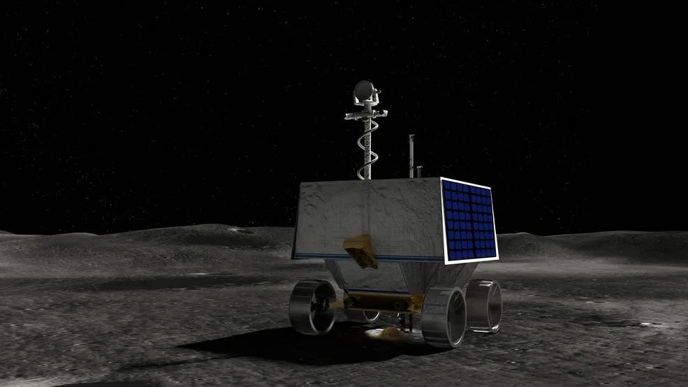

来源：[NASA VIPER Multimedia](https://science.nasa.gov/mission/viper/multimedia/)。用于标题背景时应保留NASA署名，并避免暗示该图片是本项目车辆实拍图。

也可使用本项目成功样例GIF作为右侧配图：

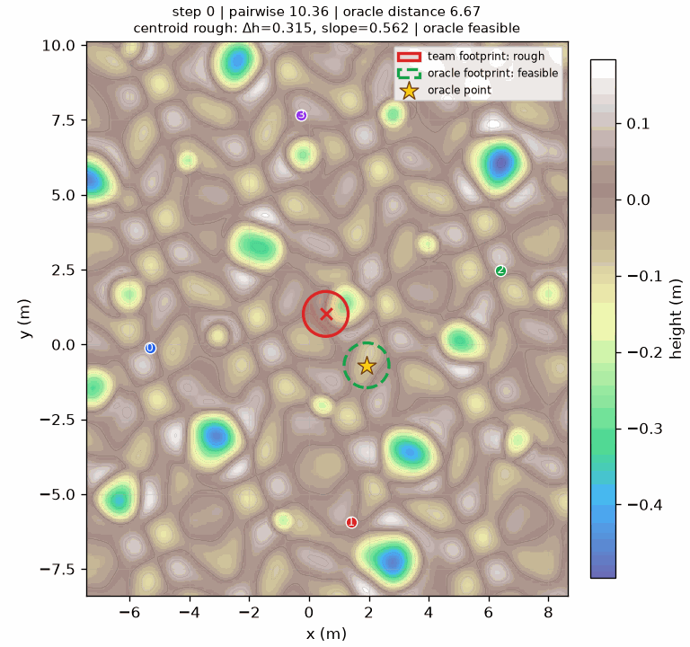

### 口头说明

本周没有获得最终通过的策略，但完成了从“怀疑信用分配”到“定位末段协同问题”的连续排查。

---

## 第2页：为什么还需要继续修改

### 页面文字

**任务标准提高后，原有策略不再收敛**

- 车辆不仅要靠近，还要在平整区域安全停稳。
- 上周N0/N1成功率接近零，超时率超过90%。
- 需要判断问题来自奖励、共同选址，还是车辆协同。

### 项目配图

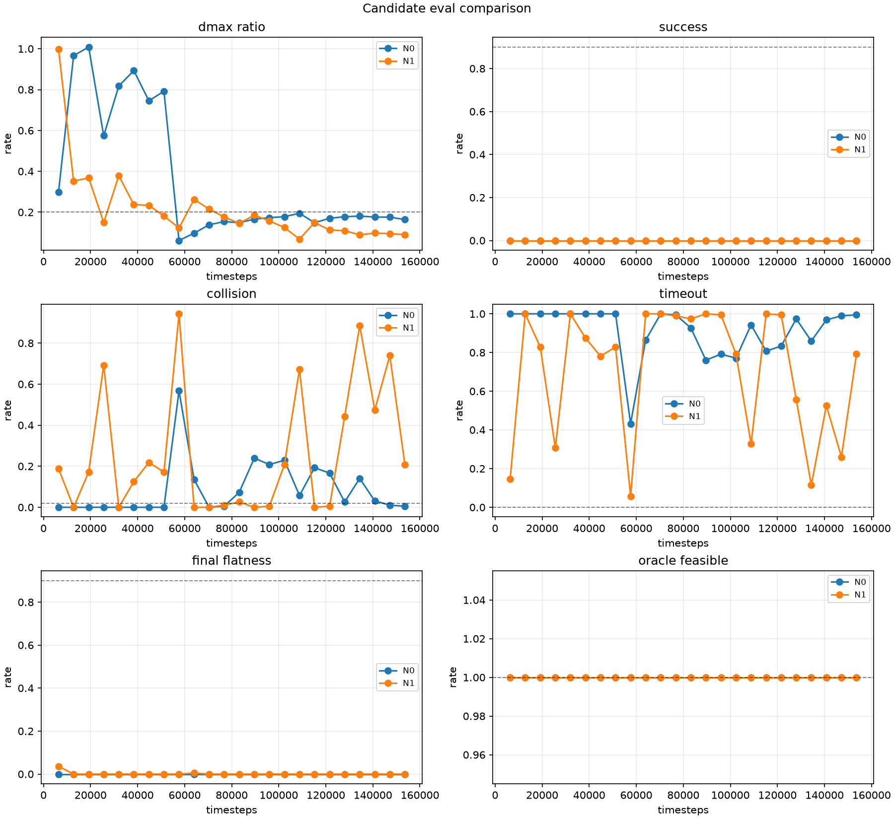

使用建议：只裁剪图中的`success`和`timeout`两个子图。该图来自项目冻结评测，能够作为上周失败的直接证据。

---

## 第3页：本周尝试总览

### 页面文字

| 尝试 | 回答的问题 | 结果 |
| --- | --- | --- |
| DAE | 团队奖励能否转化为可靠的单车评价 | 估计不可靠，停止 |
| 保守奖励拆分 | 能否无模型地去除无关奖励 | 作用过小，停止 |
| 任务分段 | 失败来自共同选址还是安全到达 | 完成问题拆分 |
| 主动共同选址 | 车辆能否发现并确认同一块平地 | 前半段验证通过 |
| 已知目标长训 | 目标已知后能否安全集合 | 基本可学，末段碰撞高 |

### 配图说明

本页没有对应的论文或项目原图。建议直接使用上述表格，不使用自绘算法图，也不把五次尝试包装成一个已经发表的统一算法。

---

## 第4页：尝试一——DAE信用分配

### 页面文字

**选择原因**

- 团队奖励混合了四辆车的好坏，难以判断单车贡献。
- DAE与现有MAPPO兼容，只改变训练评价，不改变去中心化执行。

**算法原理**

保持其他车辆的动作不变，比较本车实际动作与其他可选动作的预期结果；差值用于评价本车动作。

### 论文引用配图

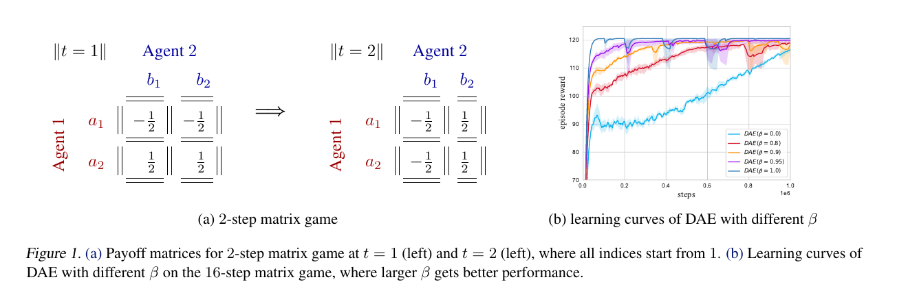

图源：Li、Xie和Lu，*Difference Advantage Estimation for Multi-Agent Policy Gradients*，ICML 2022，Figure 1。[论文官方页面](https://proceedings.mlr.press/v162/li22w.html)

使用边界：该图展示DAE在矩阵博弈中的设置和不同参数下的学习曲线，用于说明DAE确实围绕信用分配和优势估计展开；它不是本项目的网络结构图，也不是本项目实验结果。

---

## 第5页：DAE为什么没有继续训练

### 页面文字

**DAE能够粗略排列动作，但无法准确估计替代动作的平均结果**

- 替代动作平均结果误差：正常奖励波动的`2.006倍`；允许上限为`0.25倍`。
- 总奖励预测最差改善：`-5.45%`；目标为至少`15%`。
- 不准确的信用估计可能增加训练噪声，因此在长训前停止。

### 配图说明

本项目目前没有单独生成DAE门限图。建议本页使用两行大数字或一个简短表格，不引用第4页论文曲线作为本项目失败证据。正式数据来源为：

`outputs/runs/exp158_dae_validation/offline_credit_audit/metrics/offline_gate.json`

### 失败原因分析

DAE失败的核心不是“车辆动作与结果完全无关”，而是当前团队奖励同时受四辆车动作、车辆间相互影响和下一状态共同决定。奖励模型虽然能够粗略判断部分动作的相对好坏，却无法准确计算“如果只替换一辆车动作，团队平均会怎样”。将这一误差较大的结果用于训练，反而可能给策略加入新的噪声，因此没有继续长训。

---

## 第6页：尝试二——保守奖励拆分

### 页面文字

**选择原因**

- 避免DAE奖励模型产生的预测误差。
- 只移除能够明确证明与本车动作无关的奖励部分。

**结果**

- 可移除信号只占原学习信号的`2.2%至3.45%`。
- 学习波动只降低`0.42%至7.06%`，未达到`15%`门限。

### 论文引用配图

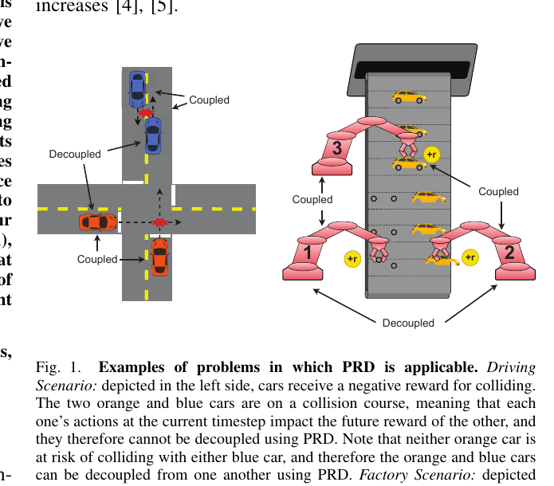

图源：Freed等，*Learning Cooperative Multi-Agent Policies with Partial Reward Decoupling*，IEEE RA-L 2022，Figure 1。[作者公开PDF](https://biorobotics.ri.cmu.edu/papers/paperUploads/PRD_camera_ready.pdf)

使用说明：左侧车辆示例说明哪些奖励必须耦合、哪些奖励可以拆开；右侧工厂示例说明奖励相关范围并不一定覆盖全部智能体。该图用于解释PRD思想，不表示本项目采用了论文中的完整PRD-AC。

### 失败原因分析

该方法过于保守。项目中最重要的集合距离、实际质心平整度、成功保持和车辆碰撞都与多辆车共同相关，不能安全地分给某一辆车后单独扣除。最终能够明确移除的只是很小一部分奖励，因此方法在数学上保持了原训练目标，却不足以明显降低学习波动。

---

## 第7页：关键转向——将任务拆开

### 页面文字

**将“共同去哪里”与“如何安全到达”分开验证**

- 上层问题：四辆车如何发现并确认同一块平地？
- 下层问题：目标已知后，车辆能否安全到达并稳定集合？
- 先分别验证两个必要能力，再重新连接完整闭环。

### 论文引用配图

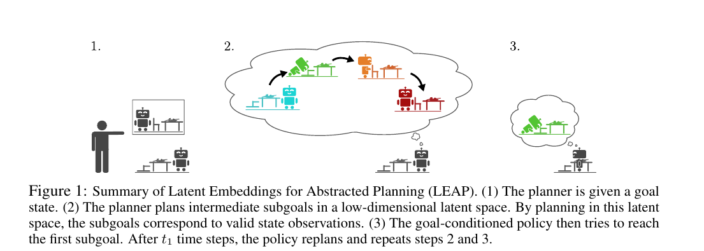

图源：Nasiriany等，*Planning with Goal-Conditioned Policies*，NeurIPS 2019，Figure 1。[论文官方页面](https://proceedings.neurips.cc/paper_files/paper/2019/hash/c8cc6e90ccbff44c9cee23611711cdc4-Abstract.html)

使用边界：该图支持“高层决定要到达的状态，低层策略负责到达”的任务拆分思想；本项目没有复现论文中的潜变量规划器。

### 局限原因分析

任务分段本身没有失败，但它只是诊断方法，不是完整解决方案。为了单独检查低层能力，受控实验提前给出了共同集合区域；这一条件在真实去中心化执行中并不会自动存在。因此，它能够帮助确定失败发生在哪一层，却不能直接作为最终策略部署。

---

## 第8页：尝试四——主动发现并确认共同平地

### 页面文字

**一次局部观测不够，需要主动获取和交换平地证据**

- 起点一次观测的总体覆盖率只有`40.80%`，近距狭窄地形为`0`。
- 车辆移动探索、保存候选，并在通信恢复后交换信息。
- 只有四辆车确认同一区域时才提交，否则继续搜索。

### 论文引用配图一：主动信息采集

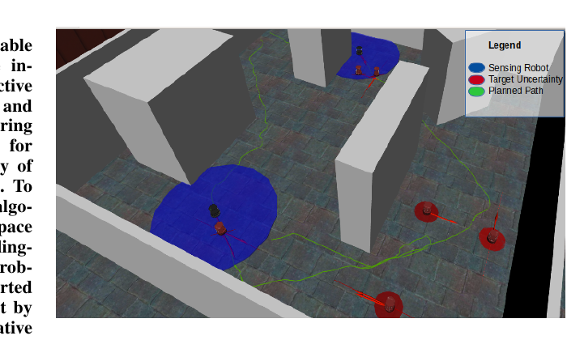

图源：Kantaros等，*Asymptotically Optimal Planning for Non-Myopic Multi-Robot Information Gathering*，RSS 2019，Figure 1。[RSS官方页面](https://roboticsproceedings.org/rss15/p62.html)

该图用于说明机器人需要同时考虑运动路径和可获得的信息，而不是只朝当前目标直行。

### 论文引用配图二：多机器人分散探索

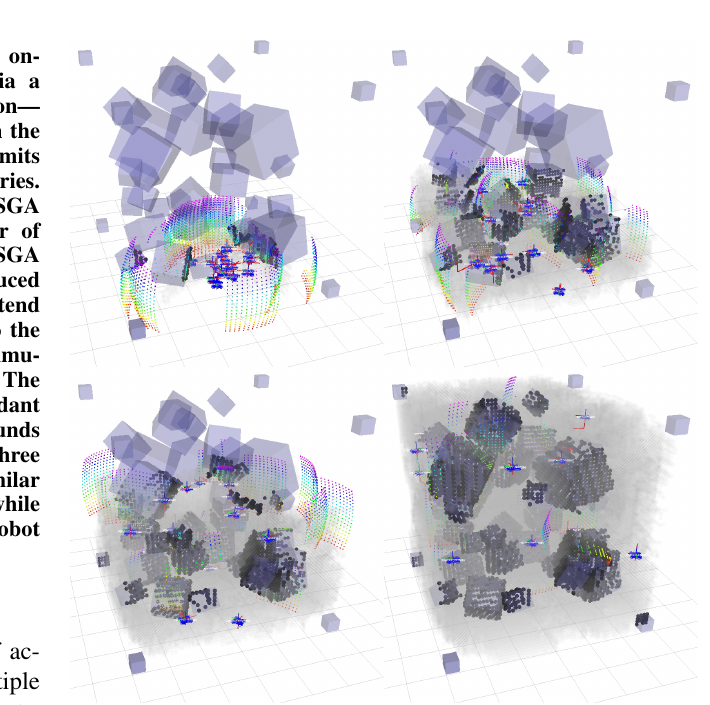

图源：Corah和Michael，*Efficient Online Multi-robot Exploration via Distributed Sequential Greedy Assignment*，RSS 2017，Figure 1。[RSS官方页面](https://www.roboticsproceedings.org/rss13/p70.html)

该图用于说明多机器人通过分工逐步覆盖未知区域，减少重复探索。

### 论文引用配图三：公共知识

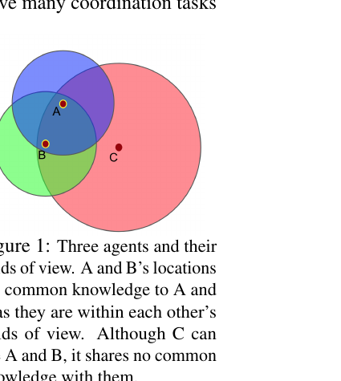

图源：Schroeder de Witt等，*Multi-Agent Common Knowledge Reinforcement Learning*，NeurIPS 2019，Figure 1。[论文官方页面](https://proceedings.neurips.cc/paper_files/paper/2019/hash/f968fdc88852a4a3a27a81fe3f57bfc5-Abstract.html)

该图用于说明“某个区域被一辆车看到”不等于“团队都知道并确认该区域”。本项目只借鉴公共知识的协调原则，没有采用MACKRL网络结构。

### 第一次失败与剩余局限

最初方案失败主要有两个原因：车辆只依赖起点附近的一次局部观测，很多平地根本没有被任何车辆看到；同时原Bottleneck场景中的100个陨石坑几乎清空了内部可行平地，使部分任务本身不可完成。加入跨时段候选记忆、主动探索并修复评测场景后，共同区域确认率达到门限。但该阶段在确认目标后让车辆停止，没有验证四辆车能否安全驶入，因此只能算“共同选址成功”，不能算完整集合成功。

---

## 第9页：评测场景修复与共同区域确认

### 页面文字

**验证暴露了一个更基础的问题：部分场景本身不可完成**

- 原狭窄场景包含100个陨石坑，内部几乎没有可供四车集合的平地。
- 调整为30个陨石坑，保留墙体、通道和坡度，不提供平地坐标。
- 修正后六类场景确认率为`97.40%至100%`，错误确认率为`0`。

### 项目配图

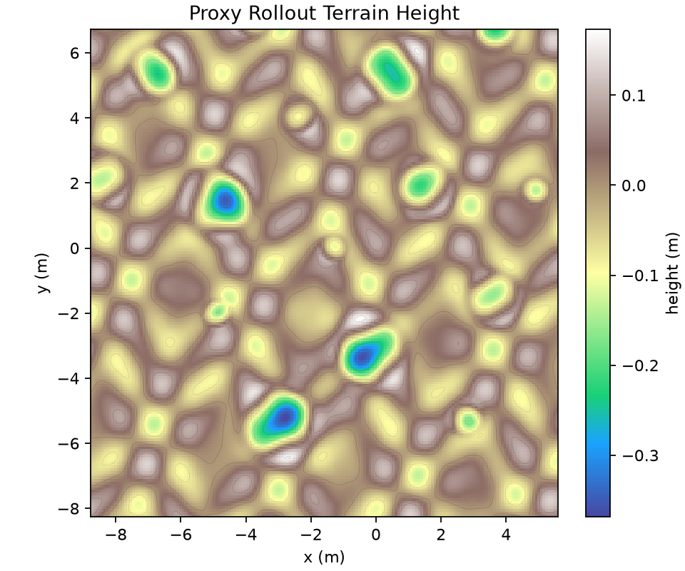

图源：exp164远距Bottleneck碰撞样例地形。该图可以展示修复后的复杂地形外观，但不应被表述为“100坑与30坑的严格前后对比”，因为原100坑版本没有保留下相同视角的正式截图。

正式确认率数据来源：

`outputs/runs/exp163_feasible_bottleneck_active_dstc/formal_1152/metrics/active_dstc_h05.json`

---

## 第10页：尝试五——共同区域已知时的受控长训

### 页面文字

**基本集合能力能够学会，但复杂场景协同仍未通过**

- 近距开阔阶段最佳：成功率`98.44%`，碰撞率`1.30%`。
- 最终复杂场景：成功率`86.98%`，碰撞率`12.50%`，超时率`0.52%`。
- 约7860万次环境交互后，主要失败由“超时不动”转为“末段碰撞”。

### 项目配图

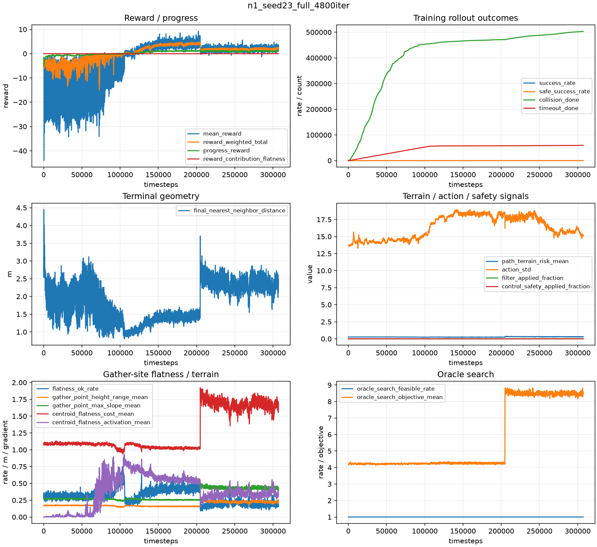

使用建议：PPT中只裁剪`Reward/progress`和`Terminal geometry`等1至2个子图；不要展示整个六联图并逐项解释。该图是训练诊断，不替代最终严格评测。

### 失败原因分析

该训练在近距开阔场景中已经能够成功，说明回合时长和基本集合动作不是主要障碍。失败集中在加入复杂地形和远距离通信之后：多辆车接近同一目标时，只能看到邻车当前或过去的状态，却不知道邻车接下来准备选择哪条路径，容易同时抢占同一空间。训练结果也很少使用原地转向和明确让行动作，说明策略没有形成稳定的末段协调方式，最终表现为碰撞率过高。

---

## 第11页：成功与失败行为对照

### 页面文字

**成功与碰撞的差异主要发生在接近目标的最后阶段**

- 成功样例：147步完成，最终最大间距1.192 m，平整度通过。
- 碰撞样例：141步终止，车辆已接近平坦目标，但末段发生碰撞。
- 车辆知道大致去哪里，但不能充分判断邻车下一步准备怎样运动。

### 项目成功动画

### 项目碰撞动画

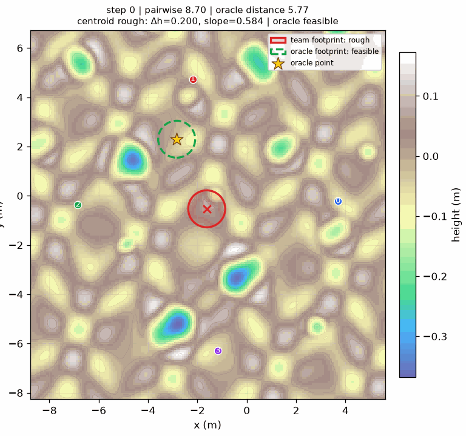

### GIF无法播放时使用的静态帧

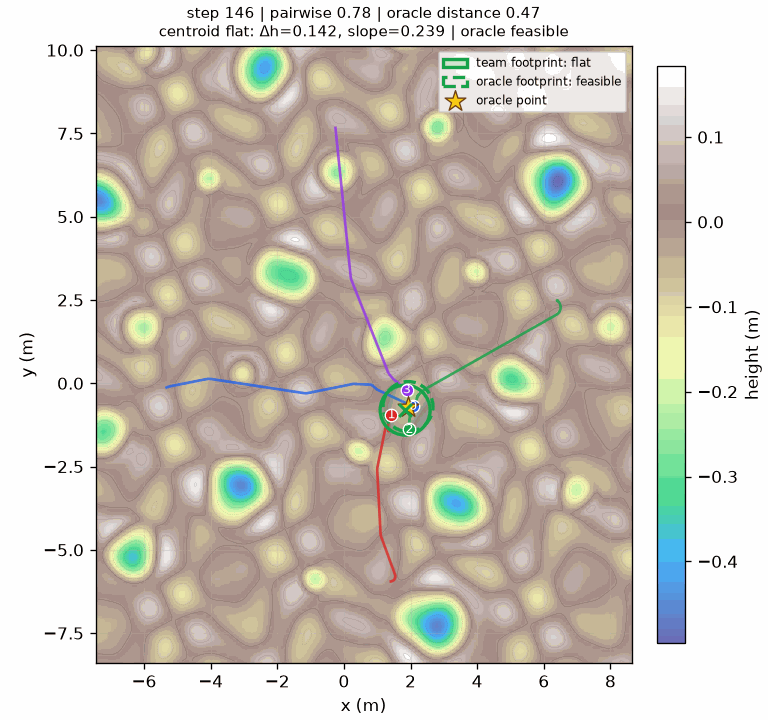

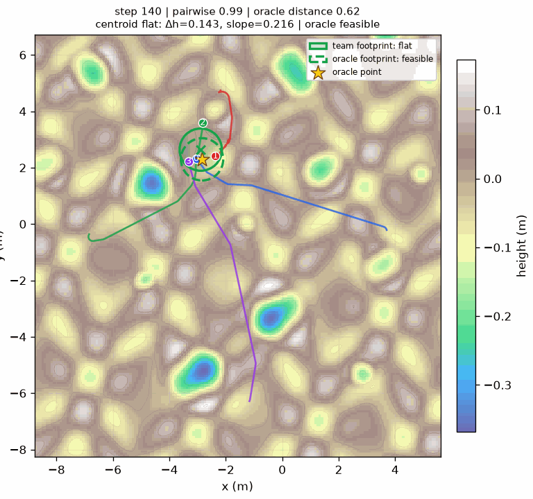

**成功样例地形底图：**

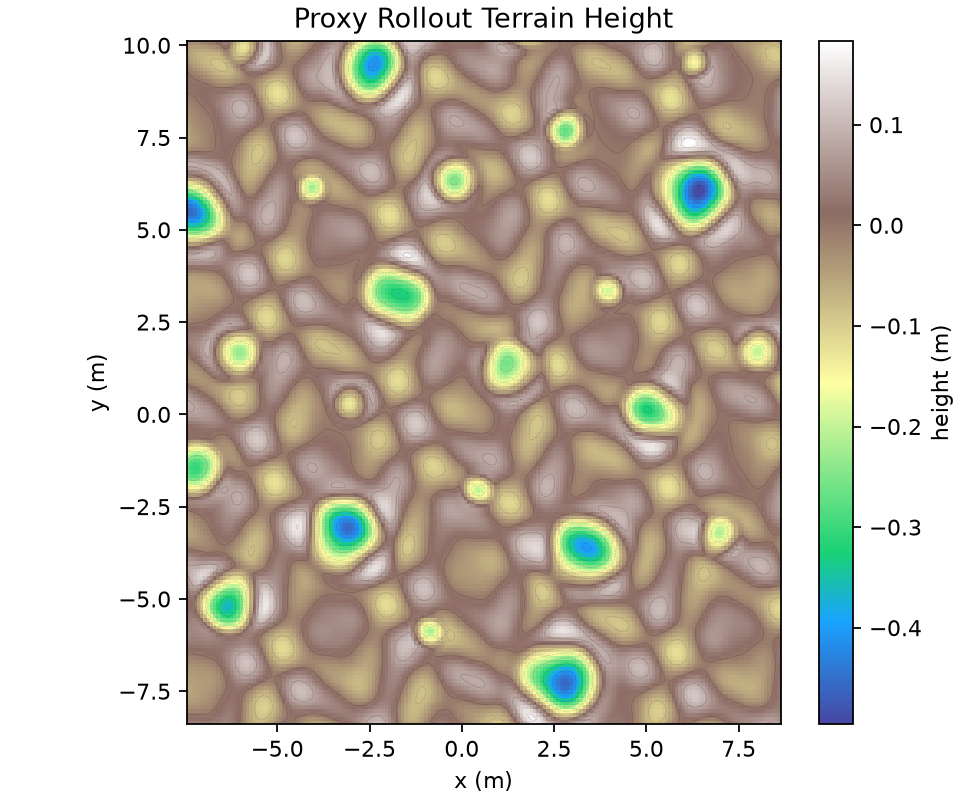

上述动画和截图只用于行为解释；正式失败结论仍以`final_eval_proxy.json`和`strict_acceptance.json`为准。

---

## 第12页：五项尝试分别说明了什么

### 页面文字

| 已经排除 | 已经确认 | 仍未解决 |
| --- | --- | --- |
| 当前DAE估计不可靠 | 主动发现和共同确认基本可行 | 复杂地形末段避碰 |
| 保守奖励拆分作用过小 | 目标已知时基本集合可学 | 远距通信下的让行协调 |

### 配图说明

本页没有对应的单一论文或项目原图。建议直接使用三列表格，不生成漏斗图或“统一算法框架图”，避免把本周多个诊断步骤误解为已经完成的新算法。

---

## 第13页：下一步计划

### 页面文字

**下一步：让车辆知道邻车已经决定怎样运动**

- 近距离通信中共享已经确定的短时运动意图，而不是共享中央指令。
- 每辆车仍根据本地地形和邻车意图独立选择下一动作。
- 不加入Actor后的中央优化、安全投影或动作覆盖。

### 论文引用配图

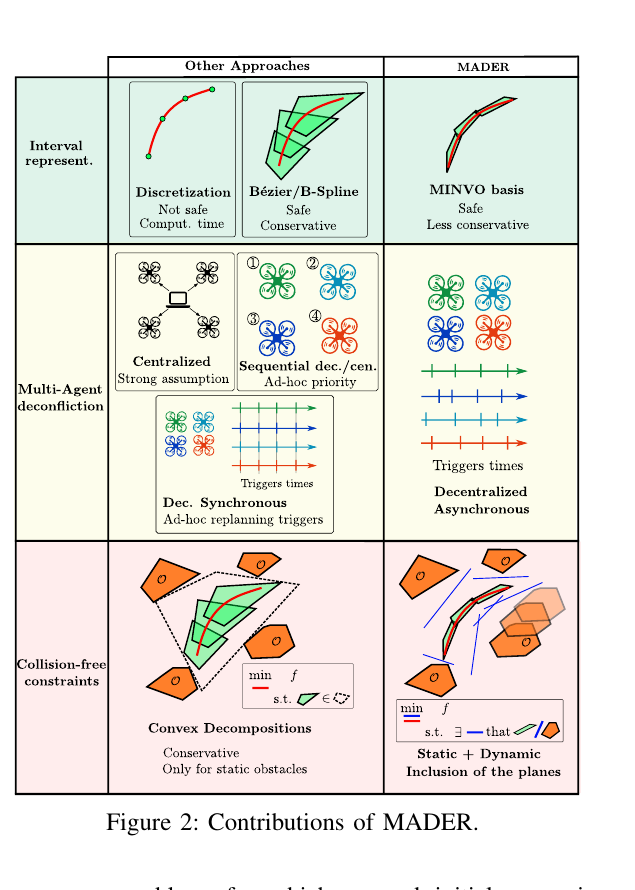

图源：Tordesillas和How，*MADER: Trajectory Planner in Multiagent and Dynamic Environments*，IEEE T-RO 2022，Figure 2。[MIT开放版本](https://dspace.mit.edu/handle/1721.1/145375)

使用边界：该图展示MADER的去中心化异步轨迹规划、轨迹表示和避碰约束。下一步只借鉴“共享已经承诺的短时轨迹”这一信息结构，不移植其完整优化器，也不能宣称获得论文相同的安全保证。

## 图片来源与版权说明

- 论文图仅用于本次学术汇报，应在对应页面底部保留作者、论文、会议或期刊及图号。
- 不应删除论文图中的坐标、图例或会改变含义的部分；本资料包只裁去周围正文。
- NASA图片应保留NASA署名，并检查原页面是否另有第三方署名。
- 项目GIF和曲线是诊断材料，不能替代严格评测结果。
