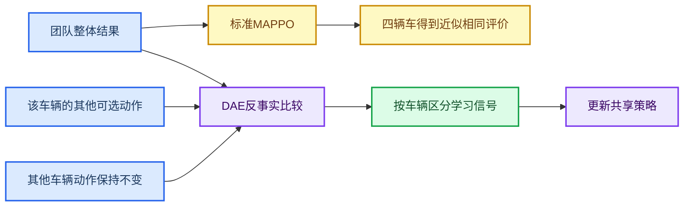

# 多月球车自组织集合项目本周工作汇总

## 一、总览

在引入集合点地形平坦度约束后，上周主要通过参数调整尝试促进策略收敛，但未取得预期效果。因此，本周转向动作接口、感知输入和训练配置等基础环节的修正，并对尚未收敛的原因开展文献调研。

## 二、本周完成的修改

### 1. 改为左右轮差速模型

将原本的自行车模型，改为直接控制左右两侧车轮速度，使训练环境与后续物理执行保持一致。

配合模型的变更，动作输出增加了倒车、原地转向，更加符合左右双轮模型的动作形式。

### 2. 优化感知输入与训练配置

由于怀疑原本的感知范围太小，使得策略网络缺乏对地形的理解，本周还完成了以下调整：

- 扩大地形感知范围，并根据距离调整感知栅格的稀疏度，使车辆能够同时考虑近场安全和较远路径；

这些修改排除了若干明显的配置问题，但训练结果仍未达到要求。因此，后续不再继续扩大网络或反复调整局部参数。

### 3. 调整地形编码器网络结构

计划比较三种地形编码结构：展平MLP（N0）、多尺度CNN（N1）和路径条件编码器（N2）。N0与N1完成了相同预算的训练；N2最初因CUDA张量连续性问题退出，修复后只完成了工程smoke验证，因此不参与本轮性能排名。

*图1：N0与N1训练过程对比。成功率始终接近零，超时率长期处于高位；下表给出完整训练后的正式评测结果。*

| 模型 | 成功率 | 碰撞率 | 超时率 | 聚集程度 | 结论 |
| --- | ---: | ---: | ---: | ---: | --- |
| N0 | 0 | 7.29% | 92.71% | 22.42% | 未通过 |
| N1 | 0.17% | 1.30% | 98.52% | 23.67% | 未通过 |
| 目标 | 至少90% | 不高于2% | 低于10% | 不高于20% | 均需满足 |

两种模型已经能够缩小车辆间距离，但无法同时满足安全、地形和平稳保持等全部成功条件。

## 三、待验证问题：团队奖励难以区分单车贡献

当前MAPPO训练根据四辆车的整体结果计算学习信号，再将近似相同的评价用于更新四辆车共享的策略。

例如，两辆车发生碰撞时，另外两辆采取合理动作的车辆也会受到相同惩罚；一辆车主动绕开危险区域所带来的收益，也可能被其他车辆的失败抵消。结果是策略能够判断“团队这一步总体好不好”，却难以判断“具体是哪辆车的哪个动作产生了影响”。

这种现象属于多智能体强化学习中的“信用分配问题”。早期集合任务相对简单，策略可能依靠稠密进度奖励完成学习；加入地形平坦度、安全和稳定保持条件后，团队结果与单车动作之间的对应关系更加复杂。因此，本周将信用分配作为一个候选原因开展了进一步调研。当前证据尚不足以认定它是唯一或主要原因，还需要与可观测性、动作表达和协调意图不足等因素区分。

## 四、文献调研与DAE方案

文献调研表明，DAE是与当前MAPPO训练框架兼容性较高的候选方法，但其启用仍应以冻结因果诊断为前提。

### 1. DAE的思路

Li、Xie和Lu在ICML 2022提出Difference Advantage Estimation（DAE）。该方法保留团队总体目标，但在训练阶段分别估计每辆车的边际贡献。[1]

其基本思路是：保持其他三辆车的动作不变，只假设其中一辆车改选其他动作，然后比较团队结果的变化。

$$
\text{车辆 }i\text{ 的信用}
=
\text{实际团队结果}
-
\text{仅替换车辆 }i\text{ 动作时的平均预期结果}.
$$

*图2：DAE不再只使用一份团队评价，而是估计每辆车动作对团队结果的相对贡献。*

DAE适合作为第一候选，主要因为它不需要替换整个训练框架：

标准MAPPO仍是合作式多智能体任务中的重要基线。[2] COMA等工作也采用了“固定其他智能体、比较单个智能体替代动作”的反事实思想，为DAE提供了直接的研究基础。[3]

### 2. 后续计划

后续首先在冻结策略和固定场景上区分信用分配、可观测性、动作表达与协调意图问题。只有当诊断确认共享团队advantage无法反映单车边际贡献时，才开展单一、受控的DAE-MAPPO对照实验，避免同时改变感知、通信和信用估计机制。

## 参考文献

[1]: Li, Y., Xie, G., & Lu, Z. (2022). [Difference Advantage Estimation for Multi-Agent Policy Gradients](https://proceedings.mlr.press/v162/li22w.html). *Proceedings of the 39th International Conference on Machine Learning*, 13066–13085.

[2]: Yu, C., Velu, A., Vinitsky, E., et al. (2022). [The Surprising Effectiveness of PPO in Cooperative Multi-Agent Games](https://proceedings.neurips.cc/paper_files/paper/2022/hash/9c1535a02f0ce079433344e14d910597-Abstract-Datasets_and_Benchmarks.html). *NeurIPS 2022 Datasets and Benchmarks*.

[3]: Foerster, J., Farquhar, G., Afouras, T., Nardelli, N., & Whiteson, S. (2018). [Counterfactual Multi-Agent Policy Gradients](https://doi.org/10.1609/aaai.v32i1.11794). *AAAI Conference on Artificial Intelligence*.
